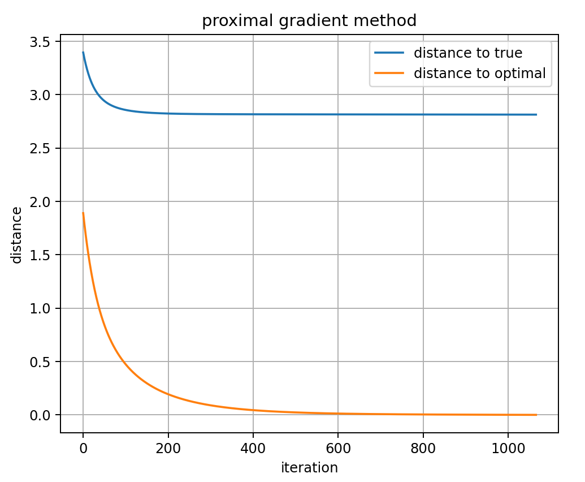
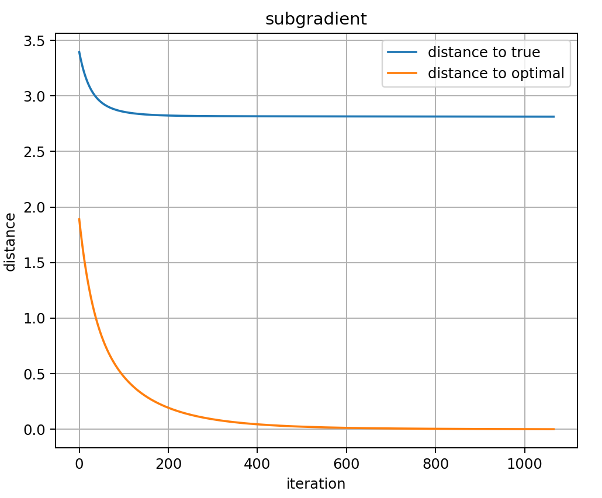

# Readme

说明：中大计算机学院21级计科《最优化理论》课程的大作业，老师是凌青。

问题：用邻近点梯度法、交替方向乘子法和次梯度法求解10节点分布式系统的一范数正则化最小二乘问题。


代码中直接调用求解的部分：

- 直接用三种算法求解：

```python
lamda = 0.01  # 可以调整
...

# 三种算法求解
x_opt1 = proximal_gradient_method(A, b, lamda)[0]
x_opt2 = admm(A, b, lamda, if_draw=False)[0]
x_opt3 = subgradient(A, b, lamda)[0]
```

- 正则化参数调整：


```python
# 调整正则化参数
# lamdas = [0.001, 0.01, 0.1, 1, 10, 100]
lamdas = [0.01, 0.1, 1, 5, 50, 100]
adjust_lamda(A, b, lamdas, 'admm')
```


结果概览：

邻近点梯度法：



交替方向乘子法：


次梯度法：


